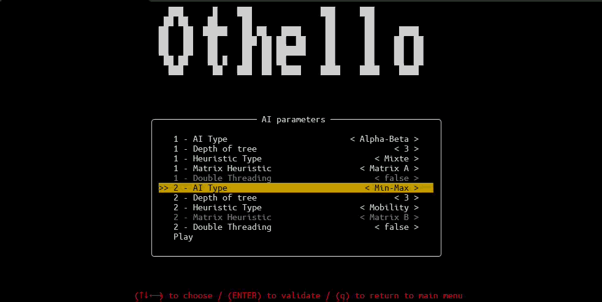
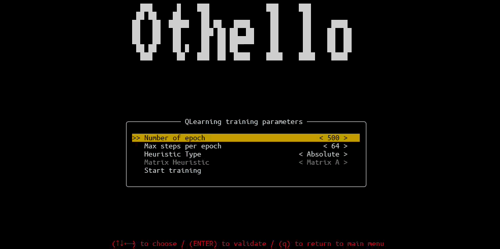

<div align="center">


</div>

# Othello game in Rust

## Features

- Ratatui for the GUI in terminal
- Human vs Human / Human vs AI / AI vs AI
- AI training with Q-learning/Alpha-Beta/Min-Max algorithm
- Multi-threading
- Test driven development
- Rustdocs documentation available

## Screenshots




## Installation

### Start the program

To start the game, install the dependencies then start the program.

```bash
  cargo install
  cargo run
```

You can also build it and then execute it for faster starting if you play again.

```bash
  cargo install
  cargo build
  ./target/debug/othello_rust
```

### Run the tests

You can run the tests with :

```bash
  cargo test
```

## Author

- SHA_foin [@SHA_foin](https://github.com/SHAfoin)
- maxlem24 (for the initial project in Go) [@SHA_foin](https://github.com/SHAfoin)

## TODO

- [x] Add Cargo docs
- [x] Add more tests
- [x] Screenshots & Gif of the program
- [x] Add timer
